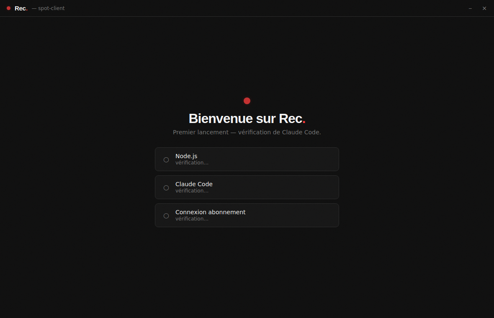
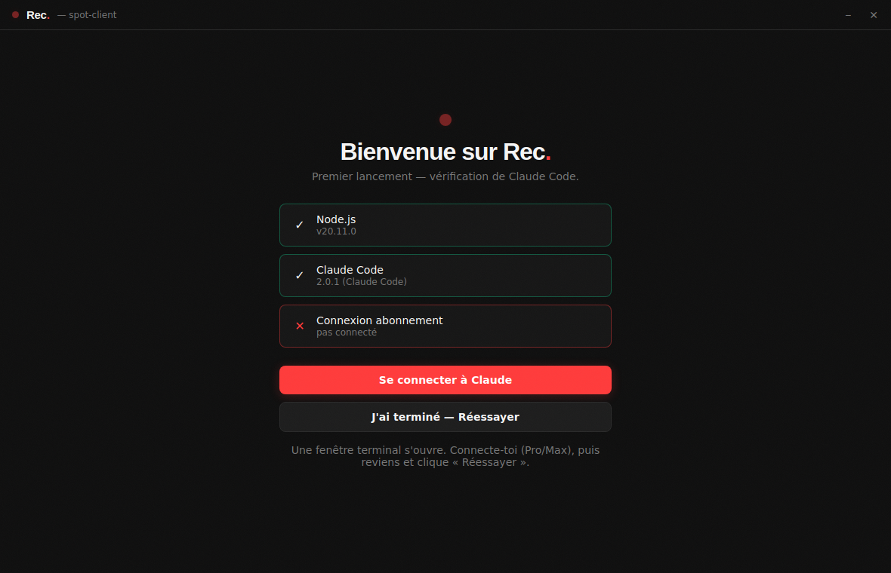
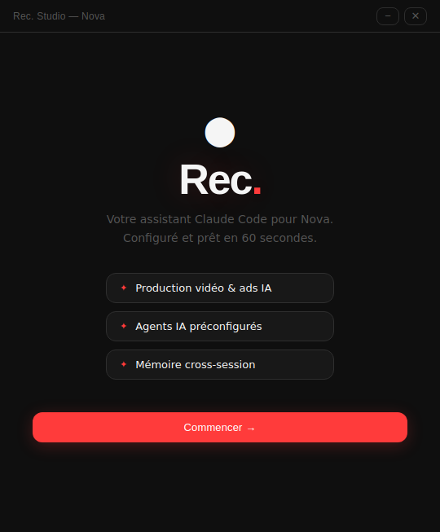
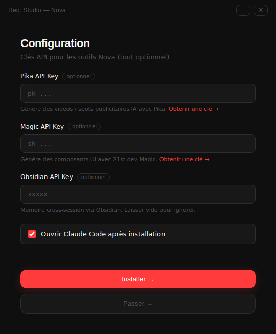
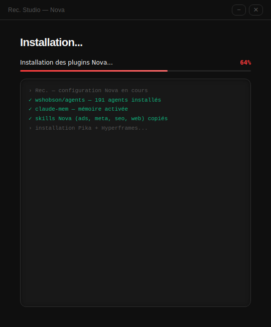
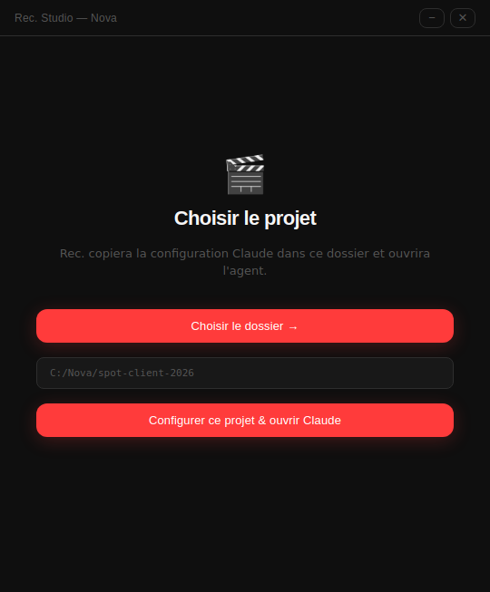
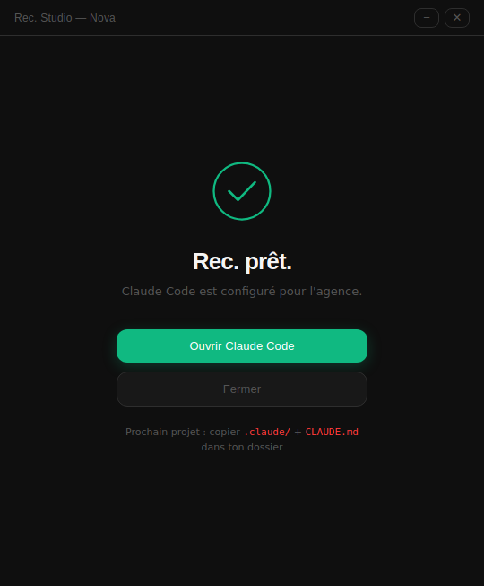

<div align="center">



# Rec. — Studio Claude Code pour Nova

**L'assistant IA de l'agence. Vidéo, Ads, Agents, Sites web, SEO — préconfiguré, prêt en 60 secondes.**

[](https://github.com/Makooff/rec-studio/releases/latest)

[](https://github.com/Makooff/rec-studio/releases)
[](https://github.com/Makooff/rec-studio/releases)
[](https://claude.ai/code)

</div>

---

## C'est quoi ?

Une **application à installer** qui configure Claude Code pour toute l'équipe Nova. Pas besoin d'être technique : tu cliques, tu choisis ton dossier projet, et Claude connaît déjà tous les services de l'agence.

| Service Nova | Tu dis simplement… |
|---|---|
| 🎬 **Spot publicitaire** | *"Crée un spot 30s pour [client], format Reels"* |
| 📈 **Campagnes Ads** | *"Lance une campagne Meta pour [client], budget 500€"* |
| 🤖 **Agents IA** | *"Automatise le suivi des leads de [client]"* |
| 🌐 **Sites web** | *"Fais un site vitrine pour [client]"* |
| 📍 **SEO local** | *"Optimise le Google Business de [client] à Bruxelles"* |

Aucune commande à retenir. Tu décris, Rec. choisit le bon outil.

---

## 🆕 Rec. App — chat direct avec Claude

Nouvelle app desktop : une **interface rouge où tu discutes avec Claude**, sans terminal. Utilise **ton abonnement Claude** (plan Pro/Max via Claude Code — zéro clé API, zéro coût au token).



- 💬 **Chat streaming** — réponses token par token, tool calls visibles
- 🗂️ **Multi-projets** — chaque dossier garde sa config `.claude/` + mémoire
- 🎬 **Agents Nova en 1 clic** — Spot, Ads, Site, SEO préconfigurés
- 🤖 **Agents custom** — crée tes propres agents (nom, rôle, outils) partagés via git
- 🔒 **Auth abonnement** — réutilise la connexion Claude Code de chaque membre

### Installation zéro-prise-de-tête

Au **premier lancement**, Rec. vérifie tout seul Node.js, Claude Code et la connexion — et installe ce qui manque. L'équipe n'a rien à faire dans un terminal.



**Pour distribuer un `.exe` à l'équipe :**
```powershell
cd app
npm install
npm run build-win
```
→ `app\dist\Rec. Setup 1.0.0.exe` — double-clic, comme n'importe quel logiciel.

---

## Aperçu

<div align="center">

| Bienvenue | Configuration | Installation |
|:---:|:---:|:---:|
|  |  |  |
| **Choix du projet** | **Prêt** | |
|  |  | |

</div>

---

## Installation — 3 étapes

### 1️⃣ Télécharger
Va dans les [**Releases**](https://github.com/Makooff/rec-studio/releases) → télécharge `Rec. Setup 1.0.0.exe`.

### 2️⃣ Installer
Double-clic sur le `.exe`. À l'écran **Configuration**, colle tes clés API (toutes optionnelles) :
- **Pika** → génération vidéo IA → [pika.art/api](https://pika.art/api)
- **Magic** → composants UI → [21st.dev](https://21st.dev)
- **Obsidian** → mémoire (laisse vide si tu n'utilises pas)

### 3️⃣ Lancer
Clique **Choisir le dossier**, sélectionne ton projet → Claude Code s'ouvre, configuré.

> ✅ Fini. Tu peux parler à Claude en français, comme à un collègue.

---

## Ce qui est inclus

- **191 agents** spécialisés (review, debug, sécurité, fullstack…)
- **Skills Nova sur-mesure** : `ads-production`, `meta-ads`, `ai-agents`, `web-creation`, `seo-local`
- **Pika + Hyperframes** — vidéo IA & motion design
- **Mémoire cross-session** (`claude-mem`) — Claude se souvient des projets
- **Routing automatique** — le bon skill s'active sans mot-clé

---

## Prérequis

- Windows 10/11
- [Node.js 20+](https://nodejs.org)
- [Claude Code](https://claude.ai/code)

*(L'installateur vérifie tout et te guide si quelque chose manque.)*

---

## Build local (développeurs)

```powershell
# Installateur
.\build.ps1

# App chat
cd app
npm install
npm run build-win   # Windows .exe
npm run build-mac   # macOS .dmg
```

---

## Déploiement (publier une version pour l'équipe)

**1. Build le `.exe` en local :**
```powershell
cd app
npm install
npm run build-win
```
→ `app\dist\Rec. Setup 1.0.0.exe`

**2. Publie sur GitHub Releases :**
- Page repo → **Releases** → **Draft a new release**
- Tag `v1.0.0`, titre `Rec. v1.0.0`
- Glisse le `.exe` dans la zone fichiers → **Publish release**

L'équipe télécharge depuis [Releases](https://github.com/Makooff/rec-studio/releases/latest).

**Mettre à jour le code du repo :**
```bash
git add -A && git commit -m "feat: ma modif" && git push origin main
```

**Nouvelle version :** bump la version dans `app/package.json`, rebuild, nouvelle Release.

---

<div align="center">
<sub>© 2026 Nova — Bruxelles. On tourne. On convertit.</sub>
</div>
